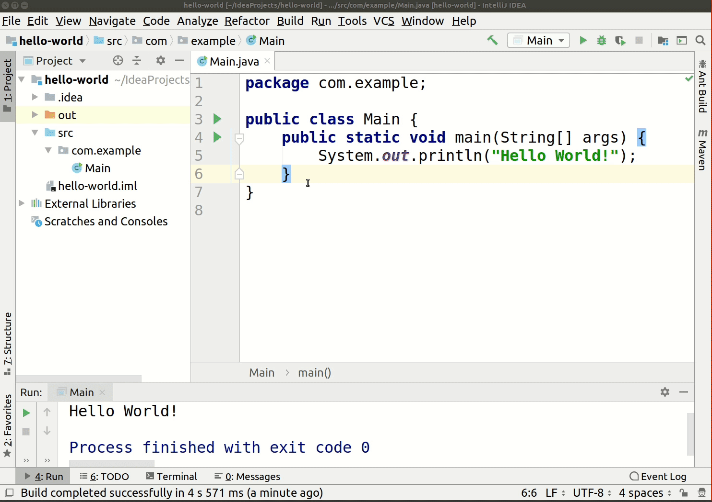

IntelliJ Twitter Integration
============================
An IntelliJ IDE plugin that helps posting code to Twitter.

## How to use
Select a piece of code, right click and choose "Tweet" in the context menu.
 

## Supported IDEs
The plugin supports all Idea based IDEs:
- Android Studio
- CLion
- DataGrip
- GoLand
- IntelliJ IDEA
- MPS
- AppCode
- PhpStorm
- PyCharm
- Rider
- RubyMine
- WebStorm
