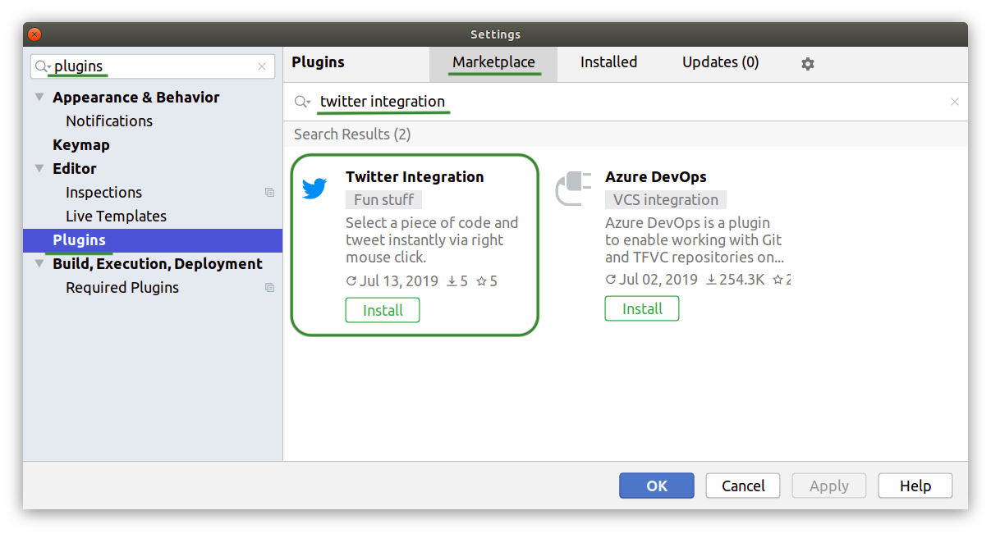

IntelliJ Twitter Integration   
============================
An IntelliJ IDE plugin that helps you post code to Twitter.

## How to use
Select a piece of code, right click and choose "Tweet" in the context menu.

## How to install
Go to `Settings` > `Plugins` > `Marketplace` tab > 
search for `Twitter Integration` > press the `Install` button.

You can also find the plugin in
[the JetBrains Plugin Repository](https://plugins.jetbrains.com/plugin/12729-twitter-integration).

## Supported IDEs
The plugin is compatible with all IntelliJ-based IDEs:
- Android Studio
- CLion
- DataGrip
- GoLand
- IntelliJ IDEA
- MPS
- AppCode
- PhpStorm
- PyCharm
- Rider
- RubyMine
- WebStorm
